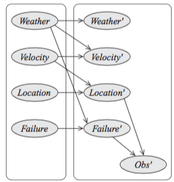
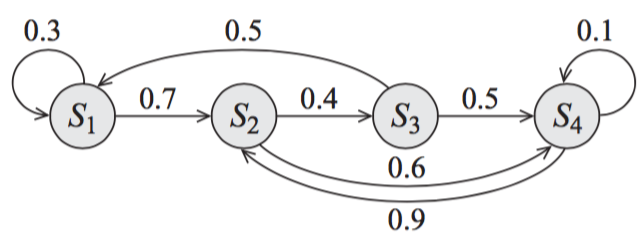

# 6.1 Introduction
> the different situations to which the network is applied all share the same general structure — all patients can be described by the same set of attributes, only the attributes’ values differ across patients. We call this type of model **_variable-based_**, since the focus of the representation is a set of random variables.

- Dynamic Bayesian Network

# 6.2 Temporal Models
隨時間改變的一組變數 $\{X^{(t)}_i\}$ 代表了在時間$t$的狀態，現在$X_i$就變成了一個template variable。

## 6.2.1 Basic Assumptions
### 將時間軸離散化
各時間點之間的間隔
$$\Delta$$
for example,
$$\Delta=1sec$$
所以原來的distribution可以分解成
$$P(X^{(0:T)})=P(X^{(0)})\prod_{t=0}^{T-1}P(X^{(t+1)}|X^{(0:t)})$$

### Markov Assumption
$\forall t\geq0$,
$$(X^{(t+1)}\perp X^{(0:t-1)}|X^{(t)})$$
此假設讓我們可以把distribution寫成串狀,
$$\cdots\rightarrow X^{(t-1)}\rightarrow X^{(t)}\rightarrow X^{(t+1)}\rightarrow \cdots$$
而在此假設下，原本的distribution可改寫成
$$P(X^{(0:T)})=P(X^{(0)})\prod_{t=0}^{T-1}P(X^{(t+1)}|X^{(t)})$$
現實中很少會出現完全符合Markov assumption的分佈，我們必須考慮所觀察的分佈是否夠接近此假設。

### Stationary System
$\forall t\geq0$,
$$P(X^{(t+1)}=\xi'|X^{(t)}=\xi)=P(X'=\xi'|X=\xi)$$
這代表不論在任何時間點上，擁有相同狀況($\xi'$ 和 $\xi$)的機率是一樣的。
我們稱$P(X'|X)$ 分佈為transition model。

## 6.2.2 Dynamic Bayesian Network
現在我們知道temporal model可用很多個transition model構成，我們開始談論transition model的細節。
 - 2-times-slice Bayesian network(2-TBN): $P(X'|X_I)$, that is, conditional Bayesian network over $X'$ given interface variables $X_I$, and $X', X_I \subset X$。

 
 - interface variable $X_I$: variables whose values at time $t$ have direct effect to time $t+1$; parents of $X'$

2-TBN寫成conditional distribution，
 $$P(X'|X_I)=\prod_{i=1}^nP(X'_i|Pa_{X'_i})$$
舉例來說，上圖的分佈寫成，
$$P(W',\cdots,F',O'|W,\cdots,F)$$
$$=P(W'|W)P(V'|W,V)P(L'|V,L)P(F'|W,F)P(O'|L',F')$$
對於每個node $X'_i$來說$P(X'_i|Pa_{X'_i})$ 是它的template factor。

再來是討論整個network
- inter-time-slice edge: 不同時間點的連結
- intra-time-slice edge: 相同時間點內的連結

被inter-time-slice連結的兩個node $X\rightarrow X'$，我們稱作persistence variables  

> **Definition** A dynamic Bayesian network (DBN) is a pair $<B_0,B_{\rightarrow}>$, where $B_0$ is a Bayesian network over $X^{(0)}$, representing the initial distribution over states, and $B_{\rightarrow}$ is a 2-TBN for the process. For any desired time span $T \geq 0$, the distribution over $X^{(0:T)}$ is defined as a unrolled Bayesian network, where, for any $i=1,\ldots,n$:
> - the structure and CPDs of $X_i^{(0)}$ are the same as those for $X_i$ in $B_0$
> - the structure and CPDs of $X_i^{(t)}$ for $t>0$ are the same as those $X'_i$ in $B_{\rightarrow}$

## 6.2.3 State-Observation Models
> In a state-observation model, we view the system as evolving naturally on its own, with our observations of it occurring in a separate process.

#### Two Assumptions:
 - Markovian
 $$(X^{(t+1)}\perp X^{(0:(t-1))}|X^{(t)})$$
 - observation at time $t$ and other states are conditionally  independent
 $$(O^{(t)}\perp X^{(0:(t-1))}, X^{(t+1:\infty)}|X^{(t)})$$

 要描述每個State-Observation Model之時，都要設定
 - transition model - $P(X'|X)$
 - observaton model - $P(O|X)$

#### Temporal System to State-Observation Models
 任何temporal system都可被看成一個state-observation model，只要我們把所有的變數分成state variable和observation variable。

 若observation variable $Y$在原始model中的parents包含上個時間點的state variable，我們可以假裝有一個新的observaton variable $\tilde{Y}$，完全等同於$Y$的值，然後再把原來的$Y$看成state variable。。

 #### Applications
 - Hidden Markov Models
 - Linear Dynamic Systems

#### Hidden Markov Models

 - Special case of DBN
 - **transition model** is often assumed to be **sparse**

上圖可以代表一個transition model，這些node用來表示state是有限多個的，而edge代表nonzero可能的transition。這個圖可被看成一個probabilistic finite-state automaton (#機率#有限狀態#自動機)。

再來討論的是observaton model，每個state都只有一個observaton，所以會把每個$P(o|s)$ 都設為1

#### Linear Dynamic Systems

>  A system of one or more real-valued variables that evolve linearly over time, with some Gaussian noise. Such systems are also often called **Kalman filters**, after the algorithm used to perform tracking. **A linear dynamical system can be viewed as a dynamic Bayesian network where the variables are all continuous and all of the dependencies are linear Gaussian.**

舉例，車子的位子和速度各用隨機變數$X$ 和$V$表示，可用下面的model去approximate，
$$ P(X'|X,V) = X + V\bigtriangleup + \mathcal{N}(0;\sigma_X^2) $$
$$ P(V'|V) = V + \mathcal{N}(0;\sigma_V^2)$$

一般化來說，
$$P(X^{(t)}|X^{(t-1)}) = AX^{(t-1)} + \mathcal{N}(0;Q)$$
$$=\mathcal{N}(AX^{(t-1)};Q) $$
而對observaton，
$$P(O^{(t)}|X^{(t)}) = HX^{(t)} + \mathcal{N}(0;R)$$
$$=\mathcal{N}(HX^{(t)};R)$$

where,
- $X$: $n$-vector of state variables
- $O$: $m$-vector of observaton variables
- $A$: $n\times n$ matrix
- $Q$: $n\times n$ covariance matrix of Gaussian noise on state
- $H$: $m\times n$ matrix
- $R$: $m\times m$ covariance matrix of Gaussian noise on observaton

To have good understanding, we recall multivariate Normal:
$$P(X) = \frac{1}{ (2\pi)^{\frac{k}{2}}|\sigma|^{\frac{1}{2}} }\exp[-\frac{1}{2}(X-\bar{X})^T\sigma^{-1}(X-\bar{X})]$$

**Alternative model**

- Nonlinear variant, also called an *extended Kalman filter*
- Discrete variable, called *switching linear dynamical system (SLDS)*

# 6.3 Template Variables and Template Factors
